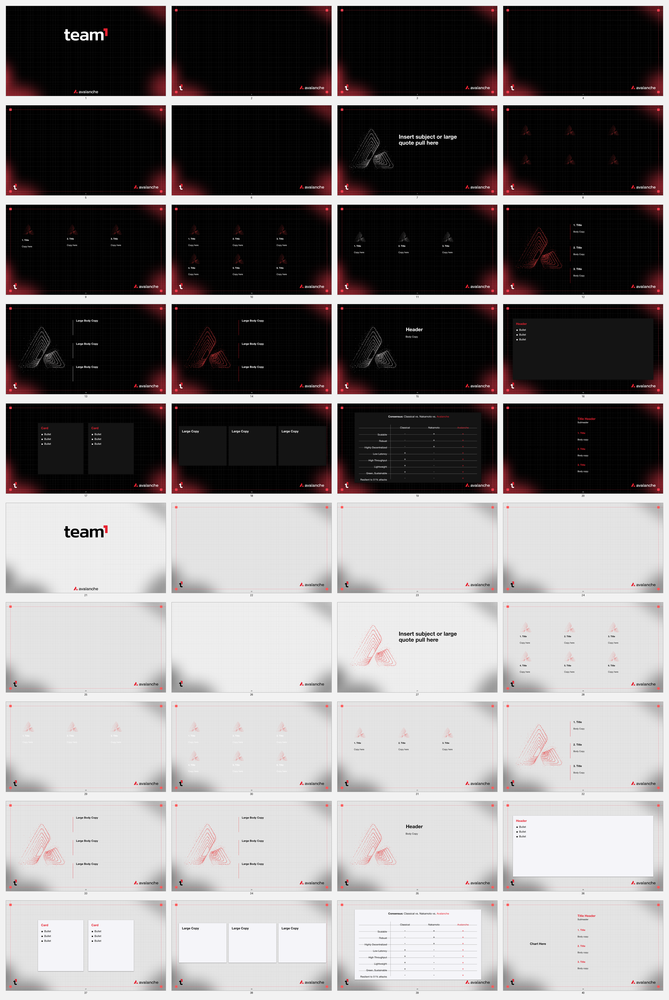

# Team1 Design System

The shared Team1 visual system for people and AI agents. It includes authentic assets, reusable presentation frames, machine-readable tokens, practical brand guidance, and one portable Agent Skill that works across supported agent harnesses.



> This is a private Team1 repository. You need `avalancheteam1` organization membership or explicit repository access. Repository access is not, by itself, permission to republish every photograph, partner mark, chapter asset, or historical claim.

## Start here

If you only want to use the design system, download the packaged skill from the [latest private release](https://github.com/avalancheteam1/design-system/releases/latest). Unzip it and keep the complete `team1-design-system` folder together—its assets, templates, tokens, and references are part of the skill.

Then follow the [cross-harness installation guide](team1-design-system/references/compatibility.md), start a fresh agent session, and try:

> Use the `team1-design-system` skill to create a six-slide Team1 event deck for [audience] in [language]. Use only these verified facts: [facts]. Deliver the editable presentation and PDF after visual QA.

More ready-to-use requests are in [agent prompts](team1-design-system/examples/agent-prompts.md).

## Repository name and skill name

The GitHub repository is `avalancheteam1/design-system`. The portable skill's stable ID and install-folder name are both `team1-design-system`.

The skill already lives in the correctly named [`team1-design-system/`](team1-design-system/) directory. Do not rename that directory or change the `name: team1-design-system` field in [`SKILL.md`](team1-design-system/SKILL.md). The repository name and skill name are intentionally allowed to differ.

## Use it with your agent

| Agent | Recommended setup | Invocation |
|---|---|---|
| Codex or ChatGPT | Upload the release ZIP in a Skills interface, or copy the complete skill folder into the local Codex skill root | `$team1-design-system` or a natural Team1 request |
| Claude Code | Copy the folder into a personal or project Claude skills directory | `/team1-design-system` |
| OpenClaw | Install the unpacked folder with the documented OpenClaw skill installer | Invoke `team1-design-system` in a fresh session |
| Hermes Agent | Copy the folder into the Hermes user skills directory, then verify it appears in `hermes skills list` | `/team1-design-system` |
| Other agent harnesses | Attach or expose the entire folder and ask the agent to read `SKILL.md` first | Use a natural Team1 request |

Exact paths, commands, verification steps, and the universal fallback are in the [installation guide](team1-design-system/references/compatibility.md).

## What is included

- [`SKILL.md`](team1-design-system/SKILL.md) — canonical agent workflow and non-negotiable rules.
- [Package guide](team1-design-system/README.md) — authority order, contents, and usage boundaries.
- [Authority](team1-design-system/references/authority.md) and [identity](team1-design-system/references/identity.md) — current source order, global colors, type, marks, and naming.
- [Presentations](team1-design-system/references/presentations.md) — current master selection and inherited-layout contract.
- [Web](team1-design-system/references/digital-and-web.md), [social](team1-design-system/references/social-and-content.md), [events/print](team1-design-system/references/events-print-and-merch.md), and [regional](team1-design-system/references/regional-and-localization.md) guidance.
- [Governance and QA](team1-design-system/references/governance-and-qa.md) — factual, visual, accessibility, rights, functional, export, and go-live checks.
- [Photography and video](team1-design-system/references/photography-and-video.md) and [voice and copy](team1-design-system/references/voice-and-copy.md) — consent-aware production and plain-language editorial rules.
- [Asset index](team1-design-system/assets/asset-index.json) — provenance, role, and status for each bundled asset.
- [Design tokens](team1-design-system/tokens/design-tokens.json) — canonical machine-readable colors and typography roles.
- Editable PowerPoint and read-only PDF references in [`templates/`](team1-design-system/templates/).
- [Sanitized Drive source audit](docs/SOURCE_AUDIT_2026-08-12.md) — authority decisions, coverage, v1 gaps, and exclusions without member data.
- [Clean-room evaluation](docs/EVALUATION_2026-08-12.md) — reproducible scenario method, baselines, frozen response hashes, and final v2 scores.

## Validate a checkout

From the repository root:

```sh
python3 team1-design-system/scripts/validate_package.py team1-design-system
python3 -m unittest discover -s tests -v
```

If you intentionally change any file inside the portable skill, refresh its checksum manifest only after the change is final, then validate again:

```sh
python3 team1-design-system/scripts/update_checksums.py team1-design-system
python3 team1-design-system/scripts/validate_package.py team1-design-system
```

Do not edit `checksums.sha256` by hand.

## Contribute or get help

- Read [CONTRIBUTING.md](CONTRIBUTING.md) before proposing a change.
- See [GOVERNANCE.md](GOVERNANCE.md) for decision and approval boundaries.
- Use [SUPPORT.md](SUPPORT.md) to choose the right issue type.
- Report security or privacy-sensitive problems through [SECURITY.md](SECURITY.md), not a normal issue.

GitHub Issues are the repository's current support channel. Discussions are not enabled.

## Usage and rights

This private repository supports authorized Team1 community work. It does not grant new trademark, copyright, photography, publicity, font, partner-asset, or external redistribution rights.

Read the package [usage notice](team1-design-system/NOTICE.md) and the status attached to each entry in the [asset index](team1-design-system/assets/asset-index.json) before publication. Metrics, links, chapter status, partner relationships, and calls to action must be verified as current. Silence from a maintainer or community lead is not approval.
